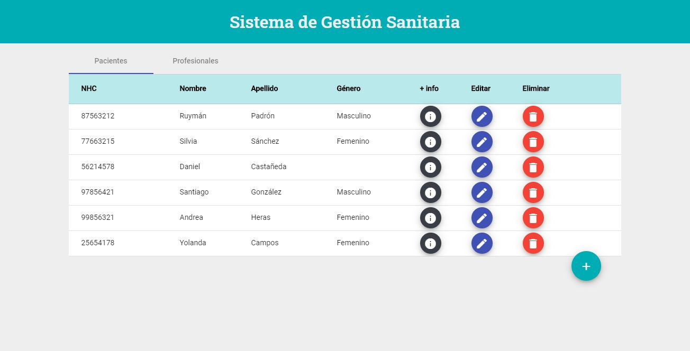

# HIS Angular Project

Frontend of the project created in the Bootcamp In House GeeksHubs - FutuRS (Ribera Salud)

This project was generated with [Angular CLI](https://github.com/angular/angular-cli) version 10.0.1.

## Deployed application

This application is already deployed in https://his-project-angular.herokuapp.com/ for testing. As it is deployed in the Heroku free tier server, it will take some time to run the first time you connect after 30 minutes.

This deployed app is connected to the backend of [this repository](https://github.com/Ruymy7/ProyectoNest_HIS) that is deployed in https://his-project-nestjs.herokuapp.com/

## Development server

1st - Run `npm i` to install all dependencies

2nd - You need to run the backend server of this repository: [link](https://github.com/Ruymy7/ProyectoNest_HIS)

3rd - Run `ng serve` for a dev server. Navigate to `http://localhost:4200/`. The app will automatically reload if you change any of the source files.

## Build

Run `ng build` to build the project. The build artifacts will be stored in the `dist/` directory. Use the `--prod` flag for a production build.
